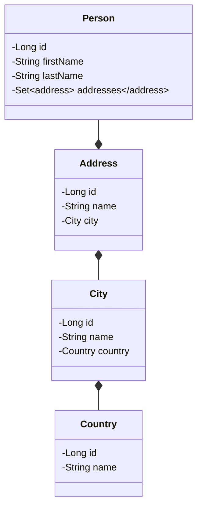

# Benchmark

Compare Fenrir with :

- Spring
- Quarkus

Dependencies :

- JPA
- Lombok
- postgreSQL database

Database model :



## Procedure

Create a project which expose REST API with JPA, build a docker image.

- measure docker image size

Do 10 times

- Start image, measure start time
- Execute requests, measure response time and compare response (code & body)

```shell
./gradlew report
```

## Compare

| Framework                  | Spring | Quarkus | Fenrir |
|----------------------------|--------|---------|--------|
| Docker size                | 377MB  | 495MB   | 120MB  |
| Start time (min)           |        |         |        |
| Start time (max)           |        |         |        |
| Start time (average)       |        |         |        |
| POST /country/ (min)       |        |         |        |
| POST /country/ (max)       |        |         |        |
| POST /country/ (average)   |        |         |        |
| POST /city/ (min)          |        |         |        |
| POST /city/ (max)          |        |         |        |
| POST /city/ (average)      |        |         |        |
| POST /address/ (min)       |        |         |        |
| POST /address/ (max)       |        |         |        |
| POST /address/ (average)   |        |         |        |
| POST /person/ (min)        |        |         |        |
| POST /person/ (max)        |        |         |        |
| POST /person/ (average)    |        |         |        |
| PUT /country/ (min)        |        |         |        |
| PUT /country/ (max)        |        |         |        |
| PUT /country/ (average)    |        |         |        |
| PUT /city/ (min)           |        |         |        |
| PUT /city/ (max)           |        |         |        |
| PUT /city/ (average)       |        |         |        |
| PUT /address/ (min)        |        |         |        |
| PUT /address/ (max)        |        |         |        |
| PUT /address/ (average)    |        |         |        |
| PUT /person/ (min)         |        |         |        |
| PUT /person/ (max)         |        |         |        |
| PUT /person/ (average)     |        |         |        |
| GET /country/ (min)        |        |         |        |
| GET /country/ (max)        |        |         |        |
| GET /country/ (average)    |        |         |        |
| GET /city/ (min)           |        |         |        |
| GET /city/ (max)           |        |         |        |
| GET /city/ (average)       |        |         |        |
| GET /address/ (min)        |        |         |        |
| GET /address/ (max)        |        |         |        |
| GET /address/ (average)    |        |         |        |
| GET /person/ (min)         |        |         |        |
| GET /person/ (max)         |        |         |        |
| GET /person/ (average)     |        |         |        |
| GET /country/1 (min)       |        |         |        |
| GET /country/1 (max)       |        |         |        |
| GET /country/1 (average)   |        |         |        |
| GET /city/1 (min)          |        |         |        |
| GET /city/1 (max)          |        |         |        |
| GET /city/1 (average)      |        |         |        |
| GET /address/1 (min)       |        |         |        |
| GET /address/1 (max)       |        |         |        |
| GET /address/1 (average)   |        |         |        |
| GET /person/1 (min)        |        |         |        |
| GET /person/1 (max)        |        |         |        |
| GET /person/1 (average)    |        |         |        |
| DELETE /country/ (min)     |        |         |        |
| DELETE /country/ (max)     |        |         |        |
| DELETE /country/ (average) |        |         |        |
| DELETE /city/ (min)        |        |         |        |
| DELETE /city/ (max)        |        |         |        |
| DELETE /city/ (average)    |        |         |        |
| DELETE /address/ (min)     |        |         |        |
| DELETE /address/ (max)     |        |         |        |
| DELETE /address/ (average) |        |         |        |
| DELETE /person/ (min)      |        |         |        |
| DELETE /person/ (max)      |        |         |        |
| DELETE /person/ (average)  |        |         |        |
