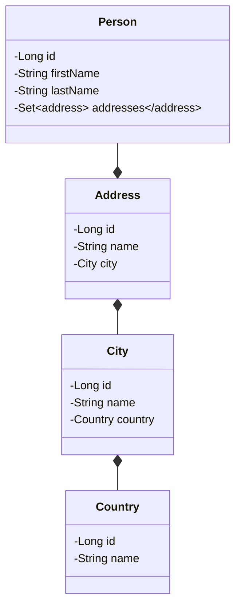

# Benchmark

Compare Fenrir with :

- Spring
- Quarkus

Dependencies :

- JPA
- Lombok
- H2 database (memory)

Database model :



## Procedure

Create a project which expose REST API with JPA, build a docker image.

- measure docker image size

Do 10 times

- Start image, measure start time
- Execute requests, measure response time

```shell
./gradlew report
```

## Compare

| Framework | Docker Size | Start time (min, max, average) | Request time (GET) | Request time (POST) | Request time (PUT) | Request time (DELETE) |
|-----------|-------------|--------------------------------|--------------------|---------------------|--------------------|-----------------------|
| Spring    | 374MB       | 3.41 seconds                   |                    |                     |                    |                       |
| Quarkus   | 489MB       | 1.65 seconds                   |                    |                     |                    |                       |
| Fenrir    | 122MB       | 1.29 seconds                   |                    |                     |                    |                       |
