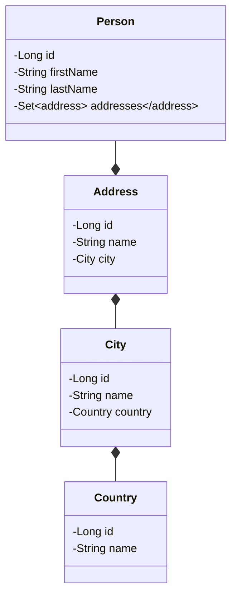

# Benchmark

Compare Fenrir with :

- Spring

Dependencies :

- JPA
- Lombok
- PostgreSQL database
- Thymeleaf
- Websockets

Database model :



## Procedure

Create a project which expose REST API with JPA, build a docker image.

- measure docker image size

Do 10 times with memory limit to 256MB, 512MB, 1GB :

- Start image, measure start time
- Execute requests on REST API, measure response time
- Navigate HTML pages, measure response time

```shell
./gradlew report
```

See [report](./report.html)