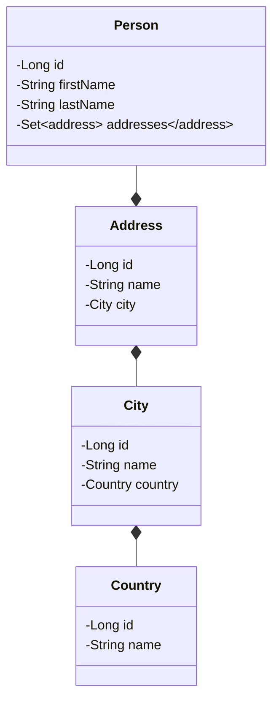

# Benchmark

Compare Fenrir with :

- Spring
- Quarkus

Dependencies :

- JPA
- Lombok
- H2 database (memory)

Database model :



## Procedure

Create a project, build a docker image.

Spring :

```
./gradlew bootBuildImage
```

Quarkus :

```
./gradlew imageBuild
```

Do 10 times
- Start image, measure start time
- Execute requests, measure response time

Average times

## Compare

| Framework | Docker Size | Server start time |
|-----------|-------------|-------------------|
| Spring    | 389MB       | 3.15 seconds      |
| Quarkus   | 489MB       | 1.85 seconds      |
| Fenrir    | 0 k         |                   |
